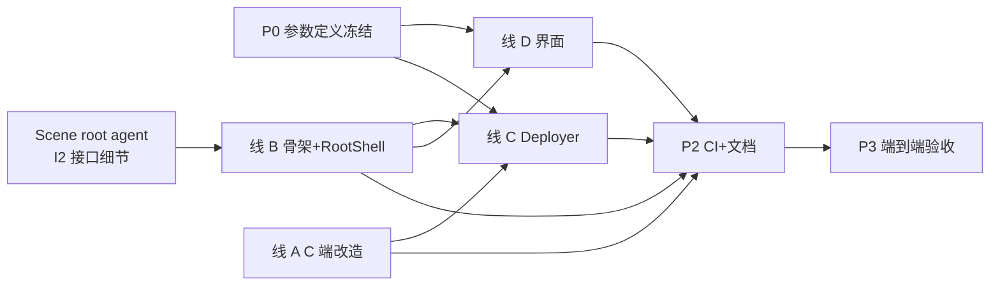

## 待办

> **规则**：已实现的任务直接删除（无论是否已验证），待办内不保留「✅ 已完成」条目，也不保留供复查的草案；同一时间只保留「未实现」项。

- **电池温度停滞判断（新想法，未做）** — 电池温度停滞后视情况结合电池电流/CPU温度等相关数据进行判断
- **WebUI 曲线着色改造（延迟，仅记录，勿执行）** — 曲线**不加断点**；颜色变化用**渐变**（非硬分段）；颜色**按各序列自身特性决定**，**弃用现有固定温度/颜色映射表**。设计细节与场景 UI 借鉴（B 整档刻度 / A 面积填充已单独立项）分离。

---

# 待定：自适应 pid 速率（可行性分析已完成，定义未定）

- 想法1：对比制冷强度与温度的方差（经变换处理后），制冷大于温度则降低倍率，小于则提高，提高/降低两侧可独立开关，制冷为 1 和上限时的部分不计入；以达到根据温度波动动态调节累计速度，以平衡温度控制效果与制冷强度波动，或者侧重其中一方的目的。
- 想法2：根据制冷强度值动态降低倍率；以达到更高制冷强度的值更难到达，且变化更平滑的目的。

> **状态**：可行性分析已完成（只读，未动任何代码）。总结论：**两个想法都可行，但定义不足**，各有必须先拍板的未定项——不补足定义无法实现。

**「倍率」的口径**：指 `PID_KDP` 与 `PID_KI_RATE`。**想法1 是在现有动态 KI 机制上修改，想法2 是新增。**

## 现状基线（分析确证）

- **`scale_up`/`scale_down` 只乘 KI 速率，完全不碰 KDP**（`pid_compute` 里 `pid_kdp` 用 `pid_kdp_coef` 原值）。所以"倍率作用于 KDP"是**新增作用点**，要改 `pid_kdp` 计算式，不是在现有基础上改。
- **时间语义不同**：`pid_kdp` 是每周期重算的瞬时量、不累积（只在温度变化时更新）；`pid_ki` 是累积量、不乘 dt（单位是"每重算周期"）。乘 KDP 只改本周期幅度，乘 KI 会改整个积分历史。
- **现有窗口只存原始电池温度一条序列**（0.1°C 码），且只在"温度窗口变化"时推入；**制冷序列从未出现过**。想法1 要新增第二条序列。
- **制冷是 PID 的输出**，从 `pid_out` 到下发隔 5 道加工：目标映射 → 限速 → 风扇独立计算 → 过温钳制 → 死区去重。有效上限 `active_cold_eff_max` **每周期随 `hot_derate` 重算**。

## 想法1 结论：可行，但定义不足

**扩展点现成**：升降两侧独立作用已是现状（`g_up`/`g_down` + `scale_up`/`scale_down` 按 `integrand` 符号分乘），是扩展不是冲突；还可顺带补上现有机制**没有总开关**的缺口。

**三处硬伤**：

1. **量纲** — 温度方差单位"码²"（默认锚点 T1 = 4.70 码² ≈ 峰峰值 0.9 ℃），制冷方差单位"制冷²"（1~190 整数，典型量级数百至数千）。直接比大小几乎**恒有"制冷 > 温度"** → 判据退化为恒真 → **永远降倍率**，与"动态调节"的意图相反。这不是调参问题，是会让功能失效的错误。原文"经变换处理后"未定义，**最阻塞的一项**。
2. **自激环** — 用控制器**输出的抖动**调**自己的增益**，构成最短闭环。现有动态 KI 用**输入侧**（温度）抖动，中间隔着被控对象，稳定性本质更好。振荡表现为中低频极限环，周期与窗口 N×5s（默认 180 s）同量级，且易被积分预算钳制与制冷限速掩盖成"偶发过冲"，不好定位。
3. **贴边排除可能把机制吃空** — 稳态时输出常逼近上限（高制冷）或下限（低负载），排除饱和区后样本可能长期少于门槛 6（窗口 N 默认 36）→ 机制整体退化为"不干预"。判定必须用**每周期重算的 `active_cold_eff_max`**（含 `hot_derate` 实时削减），不能用配置上限或 194/190 字面量。

**取样三条路**：目标制冷 `pid_align_cold`（闭环最短、自激最硬）／C 端实际 `actual_cold`（被限速削峰，系统性低估真实抖动）／设备回传 `COLD_REAL`（物理最真，但有已知不可信窗口，需复用 `report_ok` 过滤 −1 与占位值）。

## 想法2 结论：可行，但要先裁定一个方向冲突

- **与 `COLD_RPM_MAP` 不重复** — 一个调风扇转速（映射层）、一个调 PID 增益（控制层），可并存。但两者目的表述文字上很像，定义里要写明分工。
- **与 `RATE_LIMIT_COLD` 方向正相反** — 现在升速步长 = `基础值 + (电池温度 − 基准) × 倍率/10`，即**越热升得越快**；想法2 要让高制冷难到达。两级串联叠加后可能表现成"温度压不住、制冷又爬不上来"。
- **与 `HOT_DERATE` 有分母耦合** — 若用 `active_cold_eff_max` 做归一化分母，过温削减期分母变小 → 归一化值更高 → 降得更狠，等于过温保护期二次压制。
- **化解路径** — 若"高制冷"明确限定在**贴近饱和区**那段（已满负荷，再快无意义、平缓反而减少设备侧过冲），则与现有设计不冲突且与"饱和区排除"自洽。**拐点定义是关键裁定点。**

## 必须拍板的未定项

### 想法1（9 项）

1. 制冷序列取哪个量（目标 `pid_align_cold` / C 端实际 `actual_cold` / 设备回传 `COLD_REAL`）？
2. **「经变换处理后」的具体公式**：归一化分母取什么（θ / 量程 / `active_cold_eff_max` / 固定 194？），是否叠加现有 `pow_k` 变换？**最阻塞的一项。**
3. 两侧开关的语义：关掉是"完全恢复现状（含关掉现有温度侧削 KI）"还是"只关新增制冷项、现有温度项始终生效"？
4. 调制下界 `floor` 取多少？与现有 `PID_KI_DYN_GATE` 第二值共用还是新增？
5. 与现有动态 KI 的关系：串联相乘 / 取 min / 分工（如制冷项乘 KDP、温度项乘 KI）？
6. 是否作用于 KDP？（现状只作用于 KI；作用于 KDP 是新增作用点）
7. 是否新增独立总开关（现有动态 KI 无法关闭，只能把 T1 调极大使其不触发）？
8. 「在 1 或上限」的判定细则：用运行时 `active_cold_eff_max` 还是配置上限？边界是否含等号？留多少裕量？
9. 样本不足时的降级行为：沿用现有 `count_low`（不干预、保留旧 scale）还是别的策略？

### 想法2（8 项）

1. 输入量（同想法1 第 1 条）。
2. 归一化分母（`active_cold_eff_max` 会因 `hot_derate` 突变 / `active_pid_cold_max` / 固定 194 / `PID_COLD_RANGE` 第二值）？
3. **曲线形状与拐点**：线性 / 指数 / 分档？从哪个制冷值开始降？拐点是否可配？
4. 调制下界 `floor`（同想法1 第 4 条）。
5. 与现有动态 KI 的合成方式（同想法1 第 5 条）。
6. 是否作用于 KDP（同想法1 第 6 条）。
7. **与 `RATE_LIMIT_COLD` 升速侧的方向冲突如何裁定**：是否限定"仅在接近 `active_cold_eff_max` 的一段生效"？
8. `hot_derate > 0` 期间想法2 是否暂停，防二次压制？

## 实现落点与次序

- **落点**：`ki_dyn_push` / `ki_dyn_eval` / `ki_dyn_ema` / `ki_dyn_reset` / `ki_dyn_log` 五函数 + `pid_compute` + `pid_cycle` + `parse_pid_cfg`/`ki_dyn_cfg` + `pid_reset_core`。配置面仍要动 `profile.conf` + `schema.js` + `逻辑说明.md` 三处。
- **次序**：**建议先冻结重构项 R1 的 def 格式再做本机制**——R1 落地后新键只是在参数定义里加一行，反过来做等于在正要被重构的三处再手抄一遍、R1 时白干。R1 不必是硬阻塞。
- 与 R2/R3/R4 无关，不用等。**唯一例外**：若要把新量（制冷方差、当前 scale）画进曲线，会改 WebUI 数据文件的 8 字段行格式、撞上 **R7**，那就要先做 R7。
- 新增状态必须挂进 `pid_reset_core`（现有 `ki_dyn_reset()` 就挂在它末尾），否则切模式/重连后会带着旧窗口与旧削减档继续跑。
- 若新增配置键，`schema.js` 的 min/max 必须与 C 端 clamp 一致，并同步 `逻辑说明.md` 参数表。

---

# 设计已定、未实现：合并 Magisk 模块至 LSPosed 模块（路线 A）

> **状态**：设计已定，尚未动工。以下每项均为**已拍板的决策**，不是备选项；实施时不得自行改选。

## 决策基线

| 项 | 决定 |
|---|---|
| 交付物 | 由 2 个（LSPosed APK + Magisk 模块）减为 **1 个 APK** |
| 配置界面 | **原生 Android + androidx Material**；借鉴 PerfGUI（`../scene相关/scheduler开源最新/工具/PerfGUI`，React + MUI）的 Material 观感，**不搬其代码**——该项目无 LICENSE 文件，直接复制有授权问题，且它没有任何图表能力、领域是 scheduler 配置而非温控 |
| 参数定义 | 收敛为**单一来源**，界面按定义动态生成（见下方重构章节 R1/R2） |
| 配置与数据落点 | `/data/data/<包名>/files/` |
| status 双文件 | **留在 `/data/local/tmp/`**（`tempctrl.c` 与 `MainHook.java` 两侧硬编码，不动） |
| `tempctrl_last_dev` | **迁到宿主 app 自己的私有目录** `/data/data/<飞智包名>/files/`（同 uid 同域，DAC 与 SELinux 双放行；依据见 `../scene相关/decompiled/跨uid通信做法调查.md`）。已核实 `tempctrl.c` **全文只预创建 + `chmod 0666`、从不读它**，读写双方只有 `MainHook`，故不需要 root 中介、也不需要跨 uid 通道。**已裁定：各包各记、不再跨包共享**（原为四包共用一个文件）；代价是同一台散热器在另一个飞智 app 里需重新选一次 |
| 单实例锁文件 | 落**私有目录** `tempctrl.lock`（不跟 status 放一起）。**残留后果如实记下**：app「清除数据」会把它一起删掉，运行中的实例与新实例会锁到不同 inode，**那一次锁失效**，靠部署脚本开机自检兜底 |
| 界面读写 `profile.conf` | 抽 `ConfigStore`（线 C 产出），内部用**普通 Java File IO 直读直写私有目录**（同 uid，不需要 root）。写必须**原子替换**（temp + rename，C 端是 5s `mtime` 轮询，半截文件会被读到）；改单键必须**保留原文件注释与行结构**，不得整文件重写 |
| root 调用 | 照 Scene：**零依赖 `Runtime.exec`**，不引入 libsu |
| 守护进程拉起 | **`service.d` 开机先起 + app 内手动拉起入口**，靠单实例锁保证幂等 |
| 迁移方式 | **一次性切换**（回退 = git 回滚 + 手动清 `service.d` 残留） |
| 装机交互 | 取消 `customize.sh` 的音量键询问，两个开关（`APP_LAUNCH_ENABLED` / `APP_WATCHDOG`）**默认关**；部署时**保留安装前的既有配置**，仅在配置不存在时写入默认值 |

## 为什么守护进程不能由 APK 直接拉起（三条硬阻断）

1. **stopped state** — 全新安装未打开过、或被用户强停过的 app 收不到 `BOOT_COMPLETED`（Android 3.1 起广播默认带 `FLAG_EXCLUDE_STOPPED_PACKAGES`，Android 15 进一步收紧）
2. **cgroup 连带杀** — 从 app 里 `su` 起的常驻进程仍留在该 app 的 cgroup 内，app 一死就一起被杀；`nohup`/`setsid` 无效（只改父子/会话关系）
3. **LSPosed 钩子域** — 钩子以宿主 app 的 `untrusted_app` 域与 uid 运行，读不了 thermal sysfs、用不了 `am`/`dumpsys`/`pm`

> 附带：若硬走前台服务路线，Android 15+ 的 `BOOT_COMPLETED` FGS 类型白名单只有 location / connectedDevice / remoteMessaging / health / systemExempted / **specialUse**，且启动调用**必须写在 `BroadcastReceiver.onReceive()` 里**（放 `Application.onCreate` 在 Android 16 实测被拒）。

## 照 Scene 的 root 做法（`../scene相关/decompiled` 有出处）

**照搬**：

1. 零依赖，只用 `Runtime.getRuntime().exec()`（Scene 全仓库无 libsu、无 Shizuku Java API）
2. su 命令行按表选：先 `su -v` 嗅探 root 类型，再按表定——SDK<30 → `su`；SDK≥30 时 **MAGISK → `su`**、KernelSU → `su -M`、其余 → `magisk su -mm`。（出处 `../scene相关/decompiled/sources/a/a70.java` 的 `f()`；类型串由 `d()` 产出，取值是 `MAGISK` / `KernelSU` / `apd` / `mqsas` / `xsu`，**未识别时 Scene 兜底为 KernelSU**。小米专用的 `mqsas` / `xsu` 两种私有模式未照搬。）结果持久化、用户可手动切换；失败时给「当前模式 / SU CMD / 当前用户 / 日志」诊断对话框
3. 资源落盘与授权**全用 Framework 的 File API**（`setExecutable(true,false)` 并沿父目录链逐级向上），不调外部 `chmod` 二进制
4. **判活看通道连通性，不看进程**，配退避重连
5. 启动后跑一遍省电白名单批处理（`dumpsys deviceidle whitelist +`、`appops set RUN_IN_BACKGROUND allow`、`am set-standby-bucket active`、`am unfreeze --sticky`）+ `renice -n -20`

**不照搬**：rish/Shizuku 整条通路（Scene v9.3.1 里它的启动函数全库无调用点，是残留）；签名派生密钥 + AES + 长度前缀的 socket 协议（单 app 自用多余，换签名即全废）；Scene 那个"存了 Process 字段却只用一次"的半常驻 shell（无结束标记、无超时、无重连——要做就做成带结束标记 + 读超时 + 退出码回传的真常驻）；UPX 加壳。

## 文件清单

**新增（LSP 模块内）**

| 文件 | 作用 |
|---|---|
| `SetupActivity.java` | 主界面（Material）：部署状态、一键部署/卸载部署、su 诊断对话框 |
| 配置表单相关类 | 由参数定义动态生成表单（折叠分组、组头开关、min/max 钳制、改即存防抖） |
| `ChartView.java` | 自绘实时曲线（双纵轴、零相位双向滤波 + 最小步长格点吸附、断联按真实时长插空白、标签合并、背景色 halo 描边、超宽整块等比缩放） |
| 日志页相关类 | `tail -c 400KB`、跟随底部、关键词过滤、四类着色 |
| `RootShell.java` | su 封装：嗅探 → 命令行选型 → 持久化与手动切换 → 超时 + 退出码 |
| `Deployer.java` | 一次性部署：资源落盘与授权、二进制就位、`service.d` 脚本、省电白名单、路径准备、**保留既有配置** |
| `assets/tempctrl-arm64` | CI 注入的 C 二进制 |
| `assets/deploy/b6x-tempctrl.sh` | `service.d` 脚本模板 |
| `assets/params.json` | 参数定义（由重构 R1 生成的单一来源产物） |

**修改**

- `lsp模块(apk修复+温控接口)/app/src/main/AndroidManifest.xml` — 加 Activity 与权限（`POST_NOTIFICATIONS` 等）；`targetSdk` **保持 34**（提到 35/36 会触发一批与本次目标无关的行为变更）
- `lsp模块(apk修复+温控接口)/app/build.gradle.kts` — 加 androidx Material 依赖
- `magisk模块(智能温控)/tempctrl.c` — 路径常量改私有目录；加**单实例锁**（`flock` 非阻塞，第二个实例以退出码 2 自行退出）；去掉追加 `uninstall.sh` 的自清理逻辑（改由部署脚本负责清理）；**顺带**：status 双文件的预创建与 `chmod 0666` 保留不动，而 `tempctrl_last_dev` 的同类预创建已成死代码、一并删除
- `lsp模块(apk修复+温控接口)/app/src/main/java/.../MainHook.java` — **不再是「保留不动」**：`LAST_DEV_FILE` 由 `/data/local/tmp/` 改为按宿主包名拼私有目录（见上方决策基线）。**其余照旧原样**：status 双文件路径与字段、广播 action/extra、全部钩子逻辑
- `.github/workflows/build.yml` — 合并两个 job；扩大源码哈希覆盖面（见 R6）
- 文档：`README.md`、`CHANGELOG.md`、`CLAUDE.md`、`magisk模块(智能温控)/逻辑说明.md`

**删除**

`module.prop`、`META-INF/`、`customize.sh`、`uninstall.sh`、`service.sh`、`webroot/{app.js,style.css,index.html}`、`strip_webroot.py`

**保留不动**

`MainHook.java`（status 文件路径与广播协议原样）、`build_tempctrl.sh`、`patch_tls.py`、`profile.conf`（转为分发模板）

## 主要步骤

1. **工程骨架** — 加 Activity 与权限，引入 androidx Material
2. **RootShell** — 照 Scene 的五条做法实现，零新依赖
3. **C 端改造** — 路径常量、单实例锁、去掉 `uninstall.sh` 自清理；改完跑 `impact`（改 C 行为），再走 CI 编译验证
4. **Deployer** — 资源落盘与 Framework 授权；二进制落 `/data/local/tmp/tempctrl`（沿用 noexec 规避）；参数文件落私有目录且**不覆盖已有配置**；写 `service.d` 脚本；执行省电白名单
5. **原生界面** — 表单 / 曲线 / 日志三块；曲线口径照现有 `app.js` 逐条重建
6. **拉起与幂等** — `service.d` 脚本沿用现有 `service.sh` 的等亮屏 → 起 → 探活；app 内拉起入口先判活且带冷却；两处都直接执行启动命令，由 C 端单实例锁兜底
7. **CI 与文档** — 合并 job、统一版本号口径、更新四份 md

## 风险

1. **一次性切换，回退面大** — 回退 = git 回滚 + 手动清 `/data/adb/service.d/` 残留
2. **APK 卸载或"清除数据"会删掉私有目录里的配置，而 `service.d` 脚本与 `/data/local/tmp/tempctrl` 不会** → 出现"守护进程还在跑、配置已空"。需部署脚本开机自检 + C 端回退默认值。**这是私有目录落点最大的代价。**
3. **单实例锁要改 `tempctrl.c`** — 属改 C 行为，须先跑 GitNexus `impact`；评级 HIGH/CRITICAL 时先告知再继续
4. **androidx Material 是本工程第一批运行时依赖**，APK 体积上升
5. **原生界面是最大工作量**，曲线口径（双纵轴、零相位滤波、格点吸附、断联等比空白、标签合并、halo）要逐条重建
6. **装机交互丢失** — 音量键询问取消后，两个开关默认关，用户需在界面里自行开启
7. **安全模型颠覆** — APK 从"零组件零权限零 root"变为有界面、有 root 的常驻能力；首次必须手动打开 app 并授权 root
8. **Android 16 上 LSPosed 需用 fork 版本**（官方仓库 2024-01 已归档；Vector v1.10.2 起声明支持 16，但 stable 在 16 九月补丁上会崩，需 canary）
9. **真机未验证项（汇总，合并上线前必须逐条过）** —— 以下均为「源码可核、真机未验」：
   - **`service.d` 冷启动拉起与幂等** — KernelSU 版本分界（`KSU_VER_CODE < 10683` 走 `/data/adb/ksu/service.d`，靠 `ksud -V` 解析，解析不到则落 `/data/adb/service.d`）、目录需 `mkdir -p`、FBE 解锁时机（脚本靠等亮屏规避）
   - **root 往返** — `su` 嗅探与命令行选型在真机上的实际可用性；`magisk` 不在 app 的 PATH 里，`magisk su -mm` 那一支可能起不来（已用「退回裸 su」+ 手动切换兜底）
   - **SELinux 标签假设（未验证，已做防御性处置）** — `tempctrl.log` 与 `tempctrl_webui.data` 原由 root 的守护进程在 app 私有目录创建，其标签是否让 app 直读**未知**。处置：部署时用 **app 自身 uid**（普通 File IO，非 root）预创建这两个空文件，仅不存在时建。**源码已核实（非真机）**轮转是 `O_RDWR` + `ftruncate` **原地截断、不 rename 不重建**，曲线数据同为 `"a"` 追加 / `"w"` 原地重写，全库无 `rename`/`unlink`，故预创建不会被打回 root 创建。**未覆盖面**：二进制被改名、或 `LOG_FILE` 被改成别的文件名
   - **私有目录创建** — 守护进程 `mkdir` 只建一层、父目录不存在即 ENOENT 失败（刻意不逐级创建，避免 root 抢建 app 数据目录）；`files/` 若由 root 先建，其 SELinux 标签与属主是否与系统建的一致，未验
   - **审计覆盖不到的部分** — `params.json` 与 C 端 clamp 的一致性已由 `check_params.py --audit` 自动核对（漂移 0 条），但审计自己列出 7 处 C 端 clamp 与若干路径/布尔键**无法自动核对**，靠人工；另有已知盲区：核对规则里 `.log` 后缀写死，二进制改名会让核对仍通过

> **不在本次范围内的已知问题**：`TECH_DEBT.md` 未解决区条目 1（散热器偶发锁制冷 125 / 风扇 4500）。该 Bug 根因在飞智 SDK 的 gatt/controller 竞态，两侧代码都深度介入；本次合并会改变进程模型、使它的复现条件与观察手段变化。**已决定先放一放，不作为合并的前置条件。**

## 合并后遗留的清理项（P2 核出，本批未做）

> 均为**只读侧**的陈旧引用或命名问题——不影响功能，但会让后来人读到不存在的路径。逐条有出处，别当成已完成。

| # | 位置 | 现状 | 备注 |
|---|---|---|---|
| ~~L2~~ | ~~`diagnose_status.sh`~~（**实际在仓库根**，不在模块框架里） | ~~靠扫 `/data/adb/modules/*/module.prop` 定位模块~~ | **已修**：§1 改为检查部署产物；**顺带一并修了 §3**（MAC 记录新落点，否则该节同样恒空）。原实现在失效时是**静默空输出**，比"落空"更难查 |
| L3 | `ui/*.java` 多处注释 | 引 `app.js:NNNN` 作口径出处，而 `app.js` 已删 | 这些注释是**口径溯源**，直接删会丢依据；宜改指 `逻辑说明.md` 的曲线一节 |
| L4 | `参数定义/对齐报告.md`、`params.def.json` | 引 `app.js` / `webroot` | 同上，属历史溯源 |
| L5 | `webroot/schema.js` | `dataFile` 仍指 `/data/local/tmp/tempctrl_webui.data`、`configPath` 指 `/data/adb/modules/…`、自述「顺序与 profile.conf 一致」已失效 | 运行期**无人读**（仅作 `check_params.py` 的对账源），无功能影响；但它作为四源之一，语义已部分陈旧 |
| L6 | `profile.conf` 头部与 [4] 段注释 | 仍写「WebUI」 | `WEBUI_*` 五个键名与其文档描述同属此问题，但**改键名要同时动 C 端与 `params.json`**，属另一工作包 |
| L7 | `webroot/` 目录 | 现只剩 `schema.js`，目录名名不副实 | 未重命名（目录名牵 CI 路径正则与索引） |
| L8 | CI 产物名 | 仍为 `b6x-EP-LSPosed-v*`，而它已是唯一交付物 | 改名需同步发布脚本与文档 |

> P3 端到端验收的完整报告在 `.claude/路线A-P3验收报告.md`（10 项分节、逐条带 `文件:行`）。其中**功能性问题**——卸载杀不掉 service.d 看门狗 shell（导致删掉的日志被重建、守护进程可能自己回来）、`diagnose_status.sh` 定位模块目录恒落空、产物 `params.json` 的 desc 里混进了指向已删 `app.js` 的溯源标注——**已派修，不在此表**。另：`tempctrl.c` 顶部「由 `service.sh` 启动」那句已随本次修正改掉（原 L1 项）。

## Subagent 任务分配（实施用）

### 总体原则

- **文件所有权唯一**：每个文件同时只有一个 agent 可写。跨 agent 的接口先冻结再并行，否则并行等于返工。
- **优先复用审查阶段的 agent**（它们已读过对应大文件，避免重读成本）。复用后**必须重发完整修改清单**——复用上下文 ≠ 它知道要改什么。
- **阶段产物落盘且经主窗口核对后，才开下游**。不做"全并行后一次性集成"。
- **`impact` / `detect_changes` 由主窗口统一把关**，不由各 agent 各自决定，避免标准漂移。

### 必须先冻结的接口（定了才能并行）

| # | 接口 | 由谁产出 | 谁依赖 |
|---|---|---|---|
| I1 | `params.json` 的字段格式（键/类型/label/desc/min/max/分组/默认值） | P0 | 界面表单、Deployer |
| I2 | `RootShell` 的公开方法签名（执行、超时、退出码、判活） | 线 B | 线 C、线 D |
| I3 | 配置读写归属（详见下方设计缺口） | 线 C | 线 D |
| I4 | 部署完成判定的判据（脚本在不在 / 二进制在不在 / 版本对不对） | 线 C | 线 B（界面状态显示） |
| I5 | 界面 ↔ 部署的调用边界（界面只调接口，不直接碰文件） | 线 B + C | 线 D |

> **设计缺口（本方案尚未覆盖，需先拍板）**：原生界面读写 `profile.conf` 该走谁？建议抽一个 `ConfigStore` 由线 C 一并产出——否则界面会自己拼 shell 命令去读写，把 I2/I5 绕过去。

### Agent 分配

| 阶段 | Agent | 复用关系 | 职责与产出 | 文件所有权 | 依赖 |
|---|---|---|---|---|---|
| **P0** | 参数定义 def 冻结 | 复用《重复点普查》agent | 定义 def 格式、写生成脚本、产出 `params.json`、加 CI 校验步骤 | def 文件、生成脚本、CI 校验段 | — |
| **线 A** | C 端改造 | 复用《Magisk 模块全貌》agent | 路径常量改私有目录、加单实例锁、去掉 `uninstall.sh` 自清理、配置保留语义；产出可编译通过的源码 + 变更说明 | `tempctrl.c` | — |
| **线 B** | APK 工程骨架 + RootShell | 复用《LSP 模块能力边界》agent | Manifest 组件与权限、androidx Material 依赖、`RootShell`（su 嗅探/选型/持久化/超时/退出码）；产出能编译的空壳 APK | `AndroidManifest.xml`、`build.gradle.kts`、`RootShell.java` | I2 细节由《Scene root 调查》agent 提供 |
| **线 C** | Deployer + service.d + ConfigStore | 复用《Scene root 调查》agent | 资源落盘与 Framework 授权、二进制就位、`service.d` 脚本模板、省电白名单、配置保留、`ConfigStore`；产出 I3/I4 | `Deployer.java`、`ConfigStore.java`、`assets/deploy/*` | 线 A 的路径（已冻结）、I2 |
| **线 D** | 原生界面 | **新建** | 表单 / 曲线 / 日志三块；Material 观感对齐 | 界面包内所有类 | I1、I2、I5 |
| **P2** | CI 合并 + 文档 | 复用《LSP 模块能力边界》agent | 合并 `build.yml` 两个 job、二进制注入 APK、统一版本号口径、更新四份 md | `build.yml`、四份 md | A/B/C/D 全部 |
| **P3** | 端到端验收 | **新建** | 核对文件清单、路径常量三处一致、`params.json` 与 C 端 clamp 一致、卸载残留清单、CI 产物形态 | 只读 | 全部 |

**线 D 内部再拆三个子 agent**（工作量最大）：D1 配置表单（读 `params.json` 动态生成，含折叠分组、组头开关、"未生效"徽标、min/max 钳制、改即存防抖）／D2 `ChartView`（口径照 `app.js` 逐条重建）／D3 日志页。D 主 agent 只管视觉一致性与 Material 观感对齐（参照 PerfGUI 观感，不搬代码）。

> D2 最需要"通读"：曲线口径散在 `app.js`（2023 行）与 `逻辑说明.md` 的"曲线"一节。**先派子 agent 把口径整理成清单并确认，再写代码**，避免画出"看起来对但口径不对"的图。

### 依赖关系

**P0、线 A、线 B 三条可立即并行**（互不碰同一文件）；线 C 与线 D 等接口冻结后再起。

### 发给每个 agent 的启动指令必须包含

复用旧 agent 时不能只说"继续之前的工作"，必须重发：① 本次范围与**明确的文件所有权**；② **禁止改动清单**（属于别的线的文件一个字都不能碰）；③ 要遵守的已冻结接口；④ **验收标准**（能编译？CI 绿？口径逐条对上？）；⑤ 每轮产物落盘位置。

### 熔断与风险

| 风险 | 处置 |
|---|---|
| 两个 agent 改同一文件 | 靠文件所有权表；发现越界立即停该 agent |
| 线 A 的 `impact` 评级 HIGH/CRITICAL | 按规则**先告知用户再继续**，不自动往下走 |
| 界面画出来口径不对 | D2 先出"口径清单"确认，再写代码 |
| 各线产物合不到一起 | I1–I5 先冻结；P2 之前做一次一致性核对（路径常量、参数范围、接口签名） |
| 单 agent 上下文吃紧 | 每 agent 只做一条线；大文件通读一律派子 agent |
| `service.d` 真机行为未知 | 线 C 产出后先在真机验证拉起与幂等，再由 P2 收口 |

### 首批启动

**只起 P0 + 线 A + 线 B 三个**（可立即并行、互不碰文件），落盘核对后再起线 C 与线 D。

---

# 设计已定、未实现：跨文件重复信息重构

> **状态**：设计已定，尚未动工。目标不是"文档更整齐"，而是**消除必须靠人工保持同步的点**——目前项目内没有任何一处信息是"同一份只存在一份"。按"重构后维护成本最低"排序，前 4 项是主战场。

## 重构项（按收益排序）

| # | 重复的信息 | 现状（出现处） | 收敛到 | 其余处改成 |
|---|---|---|---|---|
| **R1** | **52 个参数的键名 / 类型 / 默认值 / 范围 / 分组** | 四份：`webroot/schema.js` 的 `keys`（52 键）、`profile.conf`（52 键，含注释）、`逻辑说明.md` 的参数表（52 行）、`tempctrl.c` 的 `INT_CFG_KEYS` 表 + 各 `clamp()`（47 键 = 52 − 5 个 `WEBUI_*`） | **新建一份机器可读的参数定义文件作单一来源** | ① schema 由构建期脚本生成 ② `profile.conf` 由同一脚本生成（含注释）③ 逻辑说明的参数表由同一脚本生成 ④ C 端的键表与 clamp 也由同一脚本生成。**并加 CI 校验：生成后 `git diff --exit-code`，任何手改落盘即红** |
| **R2** | 广播协议：2 个 action + 7 个 extra 名**及顺序** | 定义两处（`tempctrl.c` 的 `--ei` 位置参数、`MainHook.java` 的 `getIntExtra` 字面量）+ 文档三处 | 同上（并入参数定义文件，或单列一份协议定义） | 两端各抽常量区、同名同序；`逻辑说明.md` 只留链接（现已是）。短期先在 C 端抽 `BROADCAST_EXTRAS[]` 常量数组，避免形参序与 `--ei` 序错位 |
| **R3** | status 文件：2 条路径 + 8 个字段名 + `BLE` 编码语义 | 路径 6 处（C 端、schema、`uninstall.sh`、`diagnose_status.sh`、lsp README、逻辑说明）；字段名在 C 端散落在多个 `strncmp`、**无常量表**；lsp README 是唯一完整表 | 一份协议定义 + C 端字段常量表 | `schema.js`、`uninstall.sh`、`diagnose_status.sh` 改为从同一来源生成或运行期读取；CI 校验三端一致 |
| **R4** | 三个飞智包名 | 五处：`tempctrl.c` 宏、`MainHook.java` 常量、`res/values/arrays.xml`（LSPosed 推荐作用域）、lsp README、逻辑说明 | 同一份参数/协议定义 | `arrays.xml` 由 Gradle 构建期生成 `xposed_scope`；文档改链接。**`arrays.xml` 是第 4 份手抄，最易漏——它与 `MainHook.java` 不一致会导致管理器推荐勾错包、用户按推荐装完不生效** |
| **R5** | 编译命令 | `tempctrl.c` 顶部的注释写了一份**含 `-static`** 的旧命令，与 `build_tempctrl.sh`（自述唯一来源，明确不传 `-static`、且 `-lm` 必需）**已实际矛盾** | `build_tempctrl.sh` | 删掉 `tempctrl.c` 顶部那份命令行，改写「编译参数见 `build_tempctrl.sh`」。**这是本次普查中唯一已发生漂移的构建项**，照注释编译会得到静态二进制，触发项目刻意规避的 PT_TLS 问题 |
| **R6** | CI 二进制缓存哈希覆盖面 | `build.yml` 只对 `tempctrl.c`/`patch_tls.py`/`build_tempctrl.sh` 三个文件算哈希 | 扩大为对 `magisk模块(智能温控)/**` 取哈希（排除 `*.md`） | **当前一旦拆出 `.h` 或第二个 `.c`，缓存命中会静默跳过编译、产出旧二进制** |
| **R7** | WebUI 曲线数据文件的行格式（8 字段） | 写端 C 的格式串、读端 `app.js` 的解析、文档说明 | 协议定义 | 加 CI 断言：C 端 `%d` 个数 = 定义声明的列数 |
| **R8** | `APP_LAUNCH_ENABLED` / `APP_WATCHDOG` 的默认值 | 三方不一致：C 内默认 0/0、`profile.conf` 出厂值 1/6、`customize.sh` 刷入时又写 0/6；`逻辑说明.md` 记的是代码默认（0） | 参数定义（R1） | 一并定死"代码默认 vs 出厂值"两个概念，消除二义性 |
| **R9** | sysfs 键名名单 | 同一批键在 C 里写三遍（`is_sysfs_key`、键表 layer、`parse_sysfs_cfg` 的 `strcmp` 链） | 单一表驱动 | 新增键漏改任一处会被**静默忽略**（只打 debug 日志） |
| **R10** | 卸载清理清单 | `uninstall.sh` 的清理清单**漏了 `tempctrl_last_dev`**；日志路径靠 C 端运行期自动追加（这是全项目**唯一**成体系的信息同步机制，可作模板） | 由 C 端路径常量运行期生成 | 把现有 `.log` 自动追加机制扩展为覆盖 `tempctrl_last_dev`、status、`webui.data` |
| **R11** | 日志路径 `/cache/tempctrl.log` | 六处：C 端两处（格式串 + fallback）、`profile.conf`、`service.sh`、`uninstall.sh`、`app.js` | `profile.conf` 的 `LOG_FILE` | 其余改为读配置或同一常量。**注**：合并后 `uninstall.sh` 会消失，R10 的模板需换成部署脚本 |
| **R12** | 目录树 / 文件清单 | 四份：根 `README.md` 结构树、`CLAUDE.md` 关键文件索引、`逻辑说明.md` 两棵树、各子目录 README；已产生三处漏项（`逻辑说明.md` 漏 `uninstall.sh`/`META-INF/`、lsp README 漏 `arrays.xml`） | `CLAUDE.md` 索引表（信息量最大、面向定位） | 根 README 树只到二级目录、不回链具体文件；逻辑说明的两棵树改链接；顺带补齐漏项 |
| **R13** | 版本号 | 合并后 `module.prop` 已删；真正写入 2 处（`build.gradle.kts`、`CHANGELOG.md`）+ CI 从 `build.gradle.kts` **解析**（正确做法）+ 根 README 组件表 1 处**手抄** | `build.gradle.kts` + `CHANGELOG.md` | README 组件表改为「版本见 `build.gradle.kts`」或由 CI 生成。纯文档漂移，低优先。**注**：本次已升到 3.0（versionCode 5），是用户明确授权的，不属「自动更新版本号」 |
| **R14** | 构建环境约束 | 「NDK r27c」写在 3 文件 6 处；「Termux 编译不可用」写在 4 处 | `build_tempctrl.sh` | 其余改链接 |
| **R15** | WebUI 曲线窗口档位 / 滚动行数 | C 端常量、`schema.js` 的档位数组、逻辑说明两处 | 参数定义（R1） | 改档位需同改 C 与 schema，现无保护 |
| **R16** | 已删除机制的「墓碑」条目 | `逻辑说明.md` 内 6+ 处声明 Gear / `PID_OUT_FILTER` / `BOOT_AT` / `CTRL_MODE` / `LOG_TRIM_LINES` 等已删 | 无（保留） | 低优先；若任一机制被重新引入需同时改这些句子 |

## 已确证需更正的文档错误（可单独一个提交）

| # | 位置 | 现状 | 应改为 |
|---|---|---|---|
| D1 | `逻辑说明.md` 的 `--config` 那条常见坑 | 写「service.sh 使用 `--config "$MODDIR/profile.conf"` 直接从模块目录读取，**不再复制到 `/data/local/tmp/`**」 | 该句说的是**配置文件**不复制（属实），但同一行读起来像"什么都不复制"，而**二进制确实要复制到 `/data/local/tmp/`**（KSU noexec 约束，同文档另一处又写对了）。补一句限定语 |
| D2 | `逻辑说明.md` 判死口径 | 一处写「mtime 距现在 ≤ 5 秒」，另两处写「超 3s 判死」（`STATUS_TIMEOUT` 硬编码 3） | 统一为 3 秒 |
| D3 | `逻辑说明.md` 日志示例 | 写「≤阈值 1.0」，而默认值是 2 | 改为 2，或注明是旧版样例 |
| D4 | `逻辑说明.md` 多处 | 用 C 内部变量名 `CPU_ZONE_MIN/MAX`，而配置键是 `CPU_ZONE` | 改为 `CPU_ZONE` |
| D5 | `逻辑说明.md` 模块框架树 | 声称 `module.prop` 含 `id/name/author/version`，漏 `versionCode`/`description` | 补齐 |
| D6 | `逻辑说明.md` webroot 文件清单 | 在模块框架树里又重复列了一遍四个文件名 | 删掉重复，改「见上节」 |
| D7 | `magisk模块(智能温控)/动态KI机制流程图.md` 首行 | 写「状态：设计已定，尚未实现」，但 v2.7 已实现 | 改为「v2.7 已实现，见 CHANGELOG.md」 |
| D8 | `tempctrl.c` 顶部注释 | 含 `-static` 的编译命令（见 R5） | 改为指向 `build_tempctrl.sh` |
| D9 | `tempctrl.c` 的 `COLD_MAX` 宏 | 定义了但全文无引用（194 以字面量出现在三处）——改它不会有任何效果，是陷阱 | 删除，或让三处真正引用它 |
| D10 | `tempctrl.c` 的 `am` 调用方式 | 下发用绝对路径 `/system/bin/am`，而拉起/杀进程/`pm path` 走裸 `am` 依赖 PATH | 统一为绝对路径 |
| D11 | `CHANGELOG.md` 与 `反编译分析/总览.md` | 各有一处失效链接（指向不存在或被 `.gitignore` 排除的文件） | 修正或删除链接 |

## 其他

- **`待办.md` 自身的源码行号** — 新条目一律用「函数名 + 关键判据」定位，不再写 `tempctrl.c` 的纯行号（行号会随编辑漂移，且本项目已知索引行号恒比工作树小 1）。旧条目逐步替换。
- **`strip_webroot.py` 的目标文件列表** — 硬编码 4 个文件名；该脚本本身在路线 A 中会被删除，无需单独处理。
- **本项目自己的包名（`com.example.waspwingtempctrl`）现在写在三处** —— `app/build.gradle.kts` 的 `applicationId`（真源）、`tempctrl.c` 的 `PRIVATE_DIR` 宏、`ConfigStore.DAEMON_PRIVATE_DIR`。后两处是手抄；`ConfigStore.isPathAlignedWithDaemon()` 已作为运行期护栏（两端任一处漂移即告警），但仍建议在 R1 的生成脚本里把它一并收敛——与 R4 同类，且本次已因手抄错一次（漏写 `.example`，让守护进程指向了不存在的目录）。
- **`build.yml` 的目录名与路径触发正则** — 重命名模块目录必须同步改 CI；LSP 侧新增根级文件不在正则里、不会触发构建。**路线 A 合并 job 时一并重写。**
