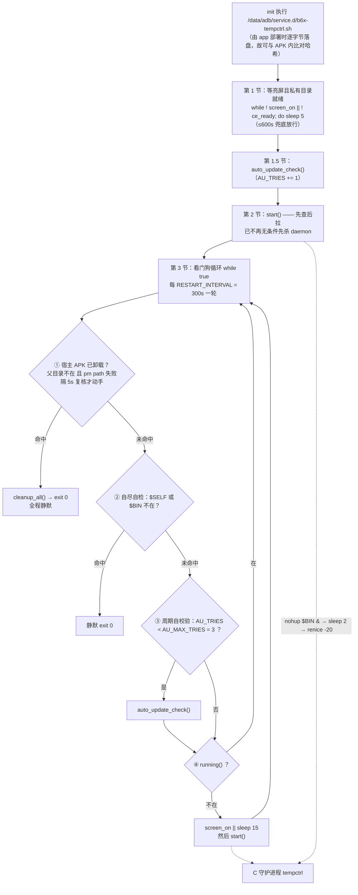
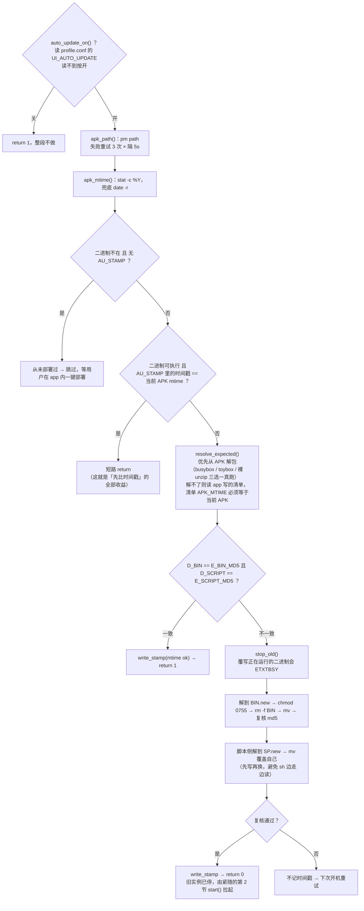
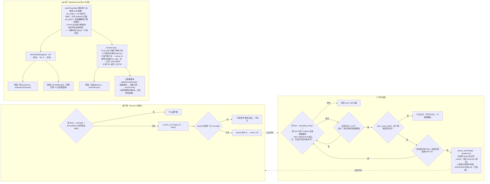

# 看门狗运行流程（service.d 脚本 + 双向保活 + 自动更新）

> 定位一律用 `文件:符号`，不用纯行号（项目约定：行号随编辑漂移）。
> 三个来源：`lsp模块/app/src/main/assets/deploy/b6x-tempctrl.sh`、`lsp模块/daemon/tempctrl.c`、`lsp模块/app/src/main/java/com/example/waspwingtempctrl/Deployer.java`。

## 一、开机起的脚本生命周期

## 二、自动更新自校验（`auto_update_check()` 的判据链）

## 三、两侧互保 + app 侧四条路径

## 四、容易记反的地方

- **两侧对 `(deleted)` 的结论故意相反**：app 侧 `bin_pids()` **必须认** `(deleted)`（部署是 `rm -f` 后 `cp`，旧实例 exe 显示 `(deleted)` 却仍持单实例锁，不认就找不到它、新实例以退出码 2 退出、盘上新二进制永不生效）；脚本侧 `running()` **必须不认**（它已不承担「换掉在跑实例」的职责）。统一哪一侧都会坏。
- **脚本第 2 节不再先杀 daemon**：这是断掉「daemon 拉看门狗 → 看门狗杀 daemon」成环的另一半。代价是开机时若已有实例在跑（例如用户抢先点了「拉起daemon」），不再替换成 service.d 拉起的规范实例，它随 app 一起被杀、再由看门狗循环在 ≤300s 内重建。
- **「停止daemon」是 app 先杀看门狗再杀 daemon**：只杀 daemon 的话看门狗 ≤5 分钟会把它拉回来。而 C 端去抖（连续两次 60s 未见才拉）正是为了让这个约 8~13 秒的窗口凑不齐两次。
- **反向保活的两处判据都翻过车，别按「想当然」写回去**：① `strstr` 搜 `/proc/pid/cmdline` 只会搜到 `argv[0]`（cmdline 是 NUL 分隔的）→ 判活恒假阴、每轮都去拉；② 父进程 `waitpid` 等一个执行整份脚本、永不退出的子进程，而 `signal()` 带 `SA_RESTART`，「3s 超时」形同虚设 → **永久阻塞在主线程 → 整条主循环停摆**（日志/曲线/BLE 全停，且 `/proc/pid/exe` 判据仍显示「在跑」）。现口径 = 逐参数整等 + double-fork 只回收中间层。完整机理与真机判据见 [TECH_DEBT.md](../TECH_DEBT.md) 已解决区 §8。
